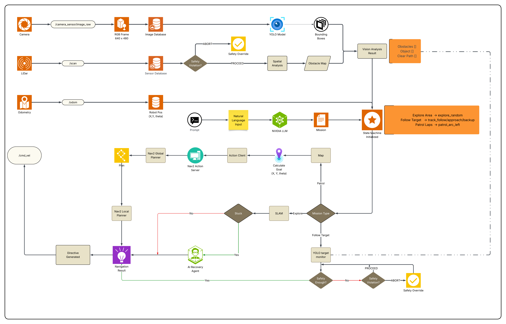
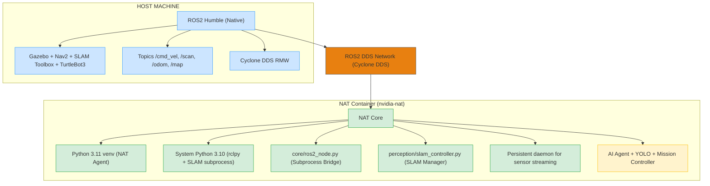

# Robot Vision Controller with AI Navigation & Autonomous SLAM Mapping

Hệ thống điều khiển robot TurtleBot3 tự động với AI Agent thông minh, tích hợp **SLAM Toolbox** cho autonomous mapping và **Nav2 navigation stack** cho path planning an toàn. Robot có thể hiểu và thực hiện nhiệm vụ phức tạp từ natural language prompts như tạo map tự động, tuần tra theo map, bám theo mục tiêu di động, và nhiều hơn nữa.

## 🤖 AI Models Used

|         Model           |                     Purpose                        |        When Used        |   Critical   |
|-------------------------|----------------------------------------------------|-------------------------|--------------|
| **LLM (Llama 3.1 70B)** | Parse natural language prompt → structured mission |       1x at startup     |    ✅ Yes    |
|    **YOLO (v11n)**      |            Object detection & tracking             | Continuous (2Hz cached) |    ✅ Yes    |

**Performance:**
- 🚀 Real-time navigation: <100ms per iteration
- 🤖 AI recovery: ~60-100ms (only when stuck)
- 💾 Memory usage: ~0.5GB (YOLO only)
- ⚡ Startup time: ~1 second
- 🗺️ SLAM mapping: Auto-save every 5s

---

## 📋 Mục lục
- [Tổng quan hệ thống](#tổng-quan-hệ-thống)
- [Kiến trúc Native ROS2](#kiến-trúc-native-ros2)
- [Mission Types](#mission-types)
- [Mission Requirements](#mission-requirements)

---

## 🏗️ Kiến trúc Native ROS2

### **Python Version Challenge**
- **NAT Agent:** Requires Python 3.11+
- **ROS2 Humble:** Supports Python 3.10 only
- **SLAM Toolbox:** System Python 3.10 subprocess
- **Solution:** Subprocess wrapper - Python 3.11 venv calls system Python 3.10 (rclpy + SLAM)

### **Communication Architecture**





**Communication Flow:**
1. **Sensor Data:** Host publishes → Cyclone DDS → Container daemon subprocess → JSON stdout → Python 3.11 cache
2. **Commands:** Python 3.11 → subprocess call → System Python 3.10 publish → Cyclone DDS → Host
3. **SLAM Control:** Python 3.11 → subprocess spawn → SLAM Toolbox (Python 3.10) → Auto-save maps
4. **Latency:** <10ms for cached reads, ~50ms for commands

**Why Cyclone DDS?**
- ✅ FastDDS had discovery issues with Docker host networking
- ✅ Cyclone DDS: stable, immediate discovery, zero extra config
- ✅ Tested: 360 LIDAR points @ 5Hz, zero packet loss

---

## 🎮 Mission Types

Robot hỗ trợ 3 loại nhiệm vụ thông qua natural language với **progressive unlock system**:

### **1. 🗺️ Explore Area** (Khám phá + SLAM Mapping)
```bash
"Khám phá tự do trong 60 giây"
"Explore the environment for 2 minutes"
"Run wide automatically and map the area"
```

**Requirements:** ✅ SLAM Toolbox installed  
**Navigation:** AI-assisted exploration với automatic stuck recovery  
**Behavior:** 
- Tự động tạo map trong quá trình explore
- Auto-save map mỗi 5 giây
- Wide sweeping motions để cover nhiều area
- Map validation khi hoàn thành
- AI Recovery Agent tự động escape khi bị stuck

**Output:** 
- Map saved tại `~/my_map.yaml` và `~/my_map.pgm`
- Coverage statistics
- Mapping duration
- AI Recovery statistics (if triggered)

**⚠️ Important:** Đây là mission bắt buộc chạy đầu tiên để tạo map cho Patrol!

---

### **2. 🔄 Patrol Laps** (Tuần tra theo map)
```bash
"Đi 20 vòng tròn"
"Patrol 5 laps"
"Go around the room 10 times"
```

**Requirements:** ✅ Map file exists (`~/my_map.yaml`)  
**Navigation:** Nav2 arc goals với pre-built map  
**Behavior:** 
- Complete N circular laps theo map
- Obstacle avoidance qua Nav2 costmap
- Return to start sau khi hoàn thành

**⚠️ Important:** Cần chạy Explore trước để tạo map, hoặc tạo map manual!

---

### **3. 🐕 Follow Target** (Bám theo mục tiêu)
```bash
"Theo sau người đang đi"
"Follow the person"
"Track the dog in front"
```

**Requirements:** ✅ Target class hợp lệ (COCO 80 classes)  
**Navigation:** Hybrid (Nav2 approach + manual tracking)  
**Behavior:** 
- Track target at safe distance (1.0-2.5m)
- Search behavior nếu mất target >3s
- Adaptive speed based on target distance

**⚠️ Important:** Mission này không cần map, có thể chạy standalone!

---

## 🔒 Mission Requirements

### **Mission Validation System**

Hệ thống tự động kiểm tra requirements trước khi start mission:

| Mission Type | Requirements | Auto-Check | Error Message |
|--------------|-------------|-----------|---------------|
| **Explore Area** | ✅ SLAM Toolbox installed | `ros2 pkg list \| grep slam_toolbox` | "Install: sudo apt install ros-humble-slam-toolbox" |
| **Patrol Laps** | ✅ Map file exists (`~/my_map.yaml`) | `os.path.exists("~/my_map.yaml")` | "Run explore mission first to create map" |
| **Follow Target** | ✅ Valid target_class | LLM parse check | "Specify target: 'Follow the person'" |

### **Progressive Unlock Flow**

```
┌─────────────────┐
│  Start System   │
└────────┬────────┘
         │
         ▼
┌─────────────────────────────┐
│ Mission: "Explore 60s"      │ ◄─── First mission (creates map)
│ ✅ SLAM Toolbox installed   │
│ ➜ Start SLAM subprocess     │
│ ➜ Navigate + auto-save map  │
│ ➜ Save final map on complete│
└────────┬────────────────────┘
         │
         │ Map created: ~/my_map.yaml
         │
         ▼
┌─────────────────────────────┐
│ Mission: "Patrol 5 laps"    │ ◄─── Unlocked after explore
│ ✅ Map found: ~/my_map.yaml │
│ ➜ Load map to Nav2          │
│ ➜ Execute circular laps     │
└─────────────────────────────┘

┌─────────────────────────────┐
│ Mission: "Follow person"    │ ◄─── Always available (no map needed)
│ ✅ Target class: person     │
│ ➜ YOLO tracking active      │
└─────────────────────────────┘
```

### **Error Handling Examples**

```bash
# ❌ Unknown mission
Input: "Make me coffee"
Error: "Mission Not Supported. Available: follow_target, patrol_laps, explore_area"

# ❌ Patrol without map
Input: "Patrol 5 laps"
Error: "Map not found at ~/my_map.yaml. Run explore mission first."

# ❌ SLAM not installed
Input: "Explore freely"
Error: "slam_toolbox package required. Install: sudo apt install ros-humble-slam-toolbox"

# ❌ Follow without target
Input: "Follow"
Error: "Target class required. Example: 'Follow the person'"
```

---

## 📝 Ghi chú quan trọng

### **SLAM Integration**

✅ **Architecture:**
- **Subprocess management:** Python 3.11 spawns SLAM Toolbox (Python 3.10)
- **Auto-save:** Map saved every 5s during exploration
- **Quality validation:** File size + existence checks
- **Graceful shutdown:** SIGTERM → SIGKILL fallback
- **Error handling:** Emergency save on crash/interrupt

✅ **Performance:**
- SLAM startup: ~3s
- Map save latency: ~1s
- Auto-save interval: 5s (configurable)
- Recommended explore duration: 60-180s

---

### **Mission Validation System**

✅ **Progressive Unlock:**
- **Level 0:** Follow Target (always available)
- **Level 1:** Explore Area (requires SLAM Toolbox)
- **Level 2:** Patrol Laps (requires map from explore)

✅ **Error Messages:**
- **User-friendly:** Clear fix instructions
- **Context-aware:** Show current state + requirements
- **Actionable:** Direct commands to resolve issues

---

### **Safety Features**

**Multi-Level Protection:**
- 🛡️ **Level 0 (Nav2 Costmap)**: Proactive path planning around obstacles
- 🛡️ **Level 1 (DWA Local Planner)**: Real-time trajectory adjustment
- 🛡️ **Level 2 (LIDAR Veto)**: Pre-execution safety check
- 🛡️ **Level 3 (20Hz Monitor)**: Continuous safety during movement
- 🛡️ **Level 4 (Immediate Abort)**: <50ms stop at critical distance

**Safety Guarantees:**
- ⚡ Response time: <50ms from detection to stop
- 🎯 Abort accuracy: 100% (blocking execution)
- 📊 Monitoring rate: 20Hz during movement
- 🔒 Override capability: LIDAR Safety > Nav2 > Manual

---

### **Limitations**

**Technical Constraints:**
- **YOLO Classes**: Limited to 80 COCO classes
- **Distance Accuracy**: LiDAR-fused (±5cm), fallback heuristic (0.12-3.5m)
- **Python Version**: Subprocess overhead (~50ms per command)
- **SLAM Quality**: Depends on exploration duration (recommend 60s+ for good maps)
- **Map Size**: Larger environments require longer explore duration
- **Host Network Required**: Container must use host network mode for ROS2 DDS
- **AI Recovery**: Only available in explore mode (not follow/patrol)
- **LLM Latency**: AI recovery adds ~60-100ms when stuck detected

**Known Issues:**
- SLAM may produce incomplete maps if exploration too short (<30s)
- Nav2 requires manual initial pose estimate in RViz
- Map overwrite warning: Re-running explore will overwrite existing map
- AI Recovery may occasionally fail to parse LLM response (uses fallback)
---

## 📚 References

- [ROS2 Humble Documentation](https://docs.ros.org/en/humble/)
- [Nav2 Documentation](https://navigation.ros.org/)
- [SLAM Toolbox](https://github.com/SteveMacenski/slam_toolbox)
- [TurtleBot3 Documentation](https://emanual.robotis.com/docs/en/platform/turtlebot3/overview/)
- [Cyclone DDS](https://github.com/eclipse-cyclonedds/cyclonedds)
- [Ultralytics YOLO](https://docs.ultralytics.com/)
- [Docker Documentation](https://docs.docker.com/)