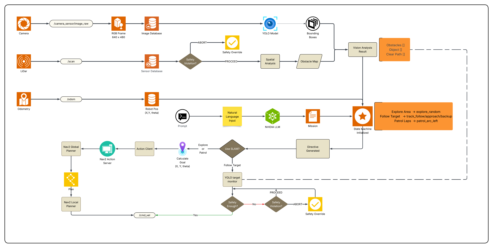

# Robot Vision Controller with AI Navigation & Nav2 Integration

Hệ thống điều khiển robot TurtleBot3 tự động với AI Agent thông minh, tích hợp **Nav2 navigation stack** cho path planning an toàn. Robot có thể hiểu và thực hiện nhiệm vụ phức tạp từ natural language prompts như đếm vật thể, bám theo mục tiêu di động, tuần tra vòng tròn, và nhiều hơn nữa.

## 🤖 AI Models Used

|         Model           |                     Purpose                        |        When Used        | Critical |
|-------------------------|----------------------------------------------------|-------------------------|----------|
| **LLM (Llama 3.1 70B)** | Parse natural language prompt → structured mission |       1x at startup     |  ✅ Yes  |
|    **YOLO (v11n)**      |            Object detection & tracking             | Continuous (2Hz cached) |  ✅ Yes  |

**Performance:**
- 🚀 Real-time navigation: <100ms per iteration
- 💾 Memory usage: ~0.5GB (YOLO only)
- ⚡ Startup time: ~1 second

---

## 📋 Mục lục
- [Cấu trúc thư mục](#cấu-trúc-thư-mục)
- [Tổng quan hệ thống](#tổng-quan-hệ-thống)
- [Kiến trúc Native ROS2](#kiến-trúc-native-ros2)
- [Mission Types](#mission-types)
- [Yêu cầu hệ thống](#yêu-cầu-hệ-thống)
- [Cài đặt](#cài-đặt)
- [Cách chạy](#cách-chạy)
- [Troubleshooting](#troubleshooting)

## 📁 Cấu trúc thư mục

```
multi_function_agent/
    ├── configs/
    │   └── config.yml                            # Cấu hình system + Nav2
    └── robot_vision_controller/
        ├── main.py                               # Entry point - ROS2 integration
        ├── core/
        │   ├── query_extractor.py                # Prompt information extraction
        │   ├── goal_parser.py                    # LLM mission parser 
        │   ├── mission_controller.py             # Mission state machine
        │   ├── ros2_node.py                      # Centralized ROS2 node
        │   └── models.py                         # YOLO model management
        ├── navigation/
        │   ├── nav2_interface.py                 # Nav2 Python interface
        │   ├── navigation_reasoner.py            # Mission-aware navigation logic
        │   └── robot_controller_interface.py     # ROS2 DDS communication
        ├── perception/
        │   ├── lidar_monitor.py                  # Real-time collision avoidance
        │   ├── robot_vision_analyzer.py          # YOLO + LIDAR spatial analysis
        │   ├── spatial_detector.py               # LIDAR spatial analysis
        │   └── rtsp_stream_handler.py            # RTSP stream handler        
        └── utils/
            ├── geometry_utils.py                 # Geometry calculation
            ├── movement_commands.py              # Commands to move
            ├── safety_checks.py                  # Safety First
            ├── ros_interface.py                  # ROS utilities
            └── log/
                ├── error_handlers.py             # Error logging
                ├── output_formatter.py           # Output logging
                └── performance_logger.py         # Performance logging

docker/   
    ├── Dockerfile                                # NAT container with ROS2 packages
    └── build_container.sh                        # Container build script

turtlebot3_ws/
└── src/
    └── custom_controller/
        └── custom_controller/
            └── rtsp_publisher.py                 # RTSP stream publisher
```

---

## 🎯 Tổng quan hệ thống

Hệ thống được thiết kế theo **kiến trúc ROS2 DDS Native Communication**, AI Agent container giao tiếp trực tiếp với ROS2 nodes qua DDS network (không qua HTTP bridge).

### **Thành phần chính:**

#### **1. ROS2 Environment (Native Host)**
```
┌─────────────────────────────────────────────┐
│   ROS2 Humble + Nav2 + Gazebo (Host)        │
├─────────────────────────────────────────────┤
│  • TurtleBot3 Burger Simulation (Gazebo)    │
│  • Nav2 Navigation Stack                    │
│    - Global Planner (Dijkstra/A*)           │
│    - Local Planner (DWA)                    │
│    - Costmap (Obstacle inflation)           │
│    - Recovery Behaviors                     │
│  • SLAM Toolbox (Real-time mapping)         │
│  • LIDAR Scanner (360° safety)              │
│  • Cyclone DDS (RMW middleware)             │
└─────────────────────────────────────────────┘
```

**ROS2 Topics:**
- `/cmd_vel` - Velocity commands
- `/scan` - LIDAR data (360 points)
- `/odom` - Odometry
- `/map` - SLAM map
- `/plan` - Nav2 path

---

#### **2. NAT-Agent Container (Python 3.11 + ROS2 Bridge)**
```
┌─────────────────────────────────────────────┐
│     NVIDIA NAT + AI Agent Container         │
├─────────────────────────────────────────────┤
│  • LLM Parser (Llama 3.1 70B)               │
│    - Natural language → Mission structure   │
│    - 1x at startup only                     │
│  • YOLO Object Detection (v11n)             │
│    - 80 COCO classes                        │
│    - 2Hz cached inference                   │
│  • Mission Controller                       │
│    - State machine for mission tracking     │
│    - Progress monitoring                    │
│  • Navigation Reasoner                      │
│    - Hybrid Nav2/Manual decision logic      │
│  • Vision Analyzer                          │
│    - YOLO + LIDAR fusion                    │
│    - Spatial awareness                      │
│  • ROS2 Subprocess Bridge                   │
│    - Python 3.11 → System Python 3.10       │
│    - Persistent daemon for sensor data      │
│    - Cyclone DDS communication              │
└─────────────────────────────────────────────┘
```

**Key Features:**
- Native ROS2 DDS communication (no HTTP bridge)
- Subprocess wrapper giải quyết Python version conflict
- Cyclone DDS for stable discovery
- YOLO-only pipeline (BLIP2 removed)
- Mission-driven autonomous behavior

---

## 🏗️ Kiến trúc Native ROS2

### **Python Version Challenge**
- **NAT Agent:** Requires Python 3.11+
- **ROS2 Humble:** Supports Python 3.10 only
- **Solution:** Subprocess wrapper - Python 3.11 venv calls system Python 3.10 (rclpy)

### **Communication Architecture**



```
┌─────────────────────────────────────────────────────────────┐
│                    HOST MACHINE                             │
│                                                             │
│  ┌─────────────────────────────────────────────────────┐    │
│  │   ROS2 Humble (Native)                              │    │
│  │   - Gazebo + Nav2 + TurtleBot3 Burger               │    │
│  │   - Topics: /cmd_vel, /scan, /odom, /map            │    │
│  │   - Cyclone DDS (RMW)                               │    │
│  └──────────────────┬──────────────────────────────────┘    │
│                     │                                       │
│                     │ ROS2 DDS Network (Cyclone DDS)        │
│                     │ (Host Network Mode)                   │
│                     │                                       │
│  ┌──────────────────▼──────────────────────────────────┐    │
│  │   NAT Container (nvidia-nat)                        │    │
│  │   - Python 3.11 venv (NAT Agent)                    │    │
│  │   - System Python 3.10 (rclpy subprocess)           │    │
│  │   - core/ros2_node.py (Subprocess Bridge)           │    │
│  │   - Persistent daemon for sensor streaming          │    │
│  │   - AI Agent + YOLO + Mission Controller            │    │
│  └─────────────────────────────────────────────────────┘    │
│                                                             │
└─────────────────────────────────────────────────────────────┘
```

**Communication Flow:**
1. **Sensor Data:** Host publishes → Cyclone DDS → Container daemon subprocess → JSON stdout → Python 3.11 cache
2. **Commands:** Python 3.11 → subprocess call → System Python 3.10 publish → Cyclone DDS → Host
3. **Latency:** <10ms for cached reads, ~50ms for commands

**Why Cyclone DDS?**
- ✅ FastDDS had discovery issues with Docker host networking
- ✅ Cyclone DDS: stable, immediate discovery, zero extra config
- ✅ Tested: 360 LIDAR points @ 5Hz, zero packet loss

---

## 🎮 Mission Types

Robot hỗ trợ 4 loại nhiệm vụ thông qua natural language:

### **1. Count Objects** (Đếm vật thể)
```bash
"Đếm 10 chai nước"
"Count 5 cups"
"Tìm 3 người"
```
**Navigation:** Nav2 exploration + YOLO detection  
**Behavior:** Explore environment, đếm objects, dừng khi đủ số lượng

---

### **2. Follow Target** (Bám theo mục tiêu)
```bash
"Theo sau người đang đi"
"Follow the person"
```
**Navigation:** Hybrid (Nav2 approach + manual tracking)  
**Behavior:** Track target at safe distance (1.0-2.5m), search if lost >3s

---

### **3. Patrol Laps** (Tuần tra vòng)
```bash
"Đi 20 vòng tròn"
"Patrol 5 laps"
```
**Navigation:** Nav2 arc goals  
**Behavior:** Complete N circular laps, return to start after completion

---

### **4. Explore Area** (Khám phá)
```bash
"Khám phá tự do"
"Explore the environment"
"Run wide automatically in 60 seconds"
```
**Navigation:** Nav2 random goals  
**Behavior:** Random waypoint generation, smooth obstacle avoidance

---

## 💻 Yêu cầu hệ thống

### **Phần mềm bắt buộc**
- **Ubuntu 22.04 LTS** (khuyến nghị)
- **ROS2 Humble** (native install on host)
- **Docker** 20.10+ 
- **NVIDIA GPU** (optional, for faster YOLO)

### **Phần cứng khuyến nghị**
- **RAM**: 8GB+ (ROS2 + Docker: ~3GB)
- **GPU**: NVIDIA with CUDA support (optional)
- **CPU**: 4+ cores
- **Disk**: 10GB free space (Docker image)

---

## 🔧 Cài đặt

### **Bước 1: Cài đặt ROS2 Humble (Host)**

```bash
# Add ROS2 repository
sudo apt update && sudo apt install -y software-properties-common curl
sudo add-apt-repository universe
curl -sSL https://raw.githubusercontent.com/ros/rosdistro/master/ros.key \
    -o /usr/share/keyrings/ros-archive-keyring.gpg
echo "deb [arch=$(dpkg --print-architecture) signed-by=/usr/share/keyrings/ros-archive-keyring.gpg] http://packages.ros.org/ros2/ubuntu jammy main" \
    | sudo tee /etc/apt/sources.list.d/ros2.list

# Install ROS2 Humble Desktop + Nav2 + TurtleBot3
sudo apt update
sudo apt install -y \
    ros-humble-desktop \
    ros-humble-navigation2 \
    ros-humble-nav2-bringup \
    ros-humble-turtlebot3* \
    ros-humble-slam-toolbox \
    ros-humble-rmw-cyclonedds-cpp

# Setup environment (IMPORTANT!)
echo "export ROS_DOMAIN_ID=0" >> ~/.bashrc
echo "export TURTLEBOT3_MODEL=burger" >> ~/.bashrc
echo "export RMW_IMPLEMENTATION=rmw_cyclonedds_cpp" >> ~/.bashrc
source ~/.bashrc
```

### **Bước 2: Cài đặt Docker**

```bash
# Install Docker Engine
curl -fsSL https://get.docker.com -o get-docker.sh
sudo sh get-docker.sh

# Add user to docker group
sudo usermod -aG docker $USER
newgrp docker
```

### **Bước 3: Clone Repository**

```bash
cd ~
git clone https://github.com/jerrynguy/final-project.git nemo-agent-toolkit
cd nemo-agent-toolkit
```

### **Bước 4: Tạo Map (chỉ cần 1 lần)**

```bash
# Terminal 1: Launch Gazebo
ros2 launch turtlebot3_gazebo turtlebot3_world.launch.py

# Terminal 2: Launch SLAM
ros2 launch slam_toolbox online_async_launch.py use_sim_time:=True

# Terminal 3: Launch RViz
rviz2

# Terminal 4: Teleop để khám phá
ros2 run turtlebot3_teleop teleop_keyboard

# Terminal 5: Save map khi đủ
cd ~
ros2 run nav2_map_server map_saver_cli -f my_map
```

### **Bước 5: Build Docker Container**

```bash
cd ~/nemo-agent-toolkit/docker
./build_container.sh
```

**Note:** Dockerfile đã include Cyclone DDS và ROS2 packages. Build time: ~5-10 phút.

---

## 🚀 Cách chạy

### **Bước 1: Start ROS2 Environment (Host)**

```bash
# Terminal 1: Launch Gazebo
ros2 launch turtlebot3_gazebo turtlebot3_world.launch.py

# Terminal 2: Launch Nav2 (TurtleBot3 version)
ros2 launch turtlebot3_navigation2 navigation2.launch.py \
    use_sim_time:=True \
    map:=$HOME/my_map.yaml

# Terminal 3: Start MediaMTX
run_in_terminal "cd ~ && ./mediamtx"

# Terminal 4: Start RTSP publisher
run_in_terminal "cd ~/turtlebot3_ws/src/custom_controller/custom_controller && python3 rtsp_publisher.py"

# Terminal 5: Run ffplay
run_in_terminal "cd ~ && ffplay rtsp://127.0.0.1:8554/robotcam"
```

### **Bước 2: Run NAT Container**

```bash
# Terminal 6: Start NAT container
cd ~/nemo-agent-toolkit/docker

docker run -it --rm \
    --network=host \
    --name nat_container \
    -e ROS_DOMAIN_ID=0 \
    -v ~/nemo-agent-toolkit/examples/multi_function_agent/src/multi_function_agent:/workspace/multi_function_agent:rw \
    -v ~/nemo-agent-toolkit/examples/multi_function_agent/configs:/workspace/configs:ro \
    nvidia-nat:v1.2.1 bash
```

### **Bước 3: Verify ROS2 Connection**

```bash
# Inside container
cd /workspace
export PYTHONPATH=/workspace:$PYTHONPATH

# Test ROS2 bridge
python3 -c "
from multi_function_agent.robot_vision_controller.core.ros2_node import get_ros2_node
import time

node = get_ros2_node()
print('✅ Bridge initialized, waiting 3s...')
time.sleep(3)

scan = node.get_scan()
odom = node.get_odom()
pose = node.get_robot_pose()

print(f'LIDAR: {len(scan.ranges) if scan else 0} points')
print(f'Odom: {\"OK\" if odom else \"None\"}')
print(f'Pose: {pose}')
"
```

**Expected output:**
```
✅ Bridge initialized, waiting 3s...
LIDAR: 360 points
Odom: OK
Pose: {'x': 0.57, 'y': 1.61, 'theta': -0.19}
```

### **Bước 4: Run Mission**

```bash
# Inside container
nat run --config_file /workspace/configs/config.yml --input "YOUR_MISSION"
```

**Example Missions:**

```bash
# Explore với Nav2
nat run --config_file /workspace/configs/config.yml --input "Run wide automatically in 60 seconds"

# Count objects (YOLO)
nat run --config_file /workspace/configs/config.yml --input "Đếm 10 chai nước"

# Follow target (Hybrid Nav2 + YOLO)
nat run --config_file /workspace/configs/config.yml --input "Theo sau người đang đi"

# Patrol laps (Nav2)
nat run --config_file /workspace/configs/config.yml --input "Đi 5 vòng tròn"
```

---

## 🔧 Troubleshooting

### **Problem: LIDAR/Odom trả về None**

**Check ROS2 environment variables:**
```bash
# On host
echo $ROS_DOMAIN_ID  # Should be 0
echo $RMW_IMPLEMENTATION  # Should be rmw_cyclonedds_cpp

# Inside container
echo $ROS_DOMAIN_ID  # Should be 0
```

**Verify topics visible:**
```bash
# Inside container
source /opt/ros/humble/setup.bash
ros2 topic list | grep -E "(scan|odom)"
```

**Solution:** Ensure matching `ROS_DOMAIN_ID` và `RMW_IMPLEMENTATION` on both host and container.

---

### **Problem: Nav2 không nhận goal**

**Check Nav2 status:**
```bash
ros2 node list | grep bt_navigator
ros2 action list | grep navigate
```

**Solution:** Set initial pose in RViz (REQUIRED!):
1. Open RViz
2. Click "2D Pose Estimate" tool
3. Click on robot's position on map
4. Drag to set orientation

---

### **Problem: Container không connect ROS2**

**Verify host network mode:**
```bash
docker inspect nat_container | grep NetworkMode
# Should be "host"
```

**Check Cyclone DDS installed:**
```bash
# Inside container
dpkg -l | grep cyclonedds
```

**Solution:** Rebuild Docker image nếu thiếu Cyclone DDS.

---

### **Problem: Daemon crashed - "Daemon reader stopped"**

**Check daemon script has Cyclone DDS:**
```bash
# On host
grep -A 2 "script = " ~/nemo-agent-toolkit/examples/multi_function_agent/src/multi_function_agent/robot_vision_controller/core/ros2_node.py | head -5
```

Should see:
```python
script = """
import os
os.environ['RMW_IMPLEMENTATION'] = 'rmw_cyclonedds_cpp'
```

**Solution:** Update `ros2_node.py` nếu thiếu dòng này.

---

## 📝 Ghi chú quan trọng

### **Native ROS2 DDS Communication**

✅ **Architecture:**
- **Subprocess wrapper:** Python 3.11 (NAT) → System Python 3.10 (rclpy)
- **Persistent daemon:** 1 long-running subprocess thay vì tạo node mới mỗi lần
- **Cyclone DDS:** Stable discovery, zero config, tested production-ready
- **Thread-safe:** Lock-protected sensor data cache

✅ **Performance:**
- Sensor data latency: <10ms (cached reads)
- Command latency: ~50ms (subprocess call)
- LIDAR rate: ~5Hz (360 points)
- Odom rate: ~10Hz

---

### **Safety Features**

**Multi-Level Protection:**
- 🛡️ **Level 0 (Nav2 Costmap)**: Proactive path planning around obstacles
- 🛡️ **Level 1 (DWA Local Planner)**: Real-time trajectory adjustment
- 🛡️ **Level 2 (LIDAR Veto)**: Pre-execution safety check
- 🛡️ **Level 3 (20Hz Monitor)**: Continuous safety during movement
- 🛡️ **Level 4 (Immediate Abort)**: <50ms stop at critical distance

**Safety Guarantees:**
- ⚡ Response time: <50ms from detection to stop
- 🎯 Abort accuracy: 100% (blocking execution)
- 📊 Monitoring rate: 20Hz during movement
- 🔒 Override capability: LIDAR Safety > Nav2 > Manual

---

### **Limitations**

**Technical Constraints:**
- **YOLO Classes**: Limited to 80 COCO classes
- **Distance Accuracy**: LiDAR-fused (±5cm), fallback heuristic (0.12-3.5m)
- **Python Version**: Subprocess overhead (~50ms per command)
- **Map Dependency**: Nav2 requires pre-built SLAM map
- **Host Network Required**: Container must use host network mode for ROS2 DDS

---

## 📚 References

- [ROS2 Humble Documentation](https://docs.ros.org/en/humble/)
- [Nav2 Documentation](https://navigation.ros.org/)
- [TurtleBot3 Documentation](https://emanual.robotis.com/docs/en/platform/turtlebot3/overview/)
- [Cyclone DDS](https://github.com/eclipse-cyclonedds/cyclonedds)
- [Ultralytics YOLO](https://docs.ultralytics.com/)
- [Docker Documentation](https://docs.docker.com/)